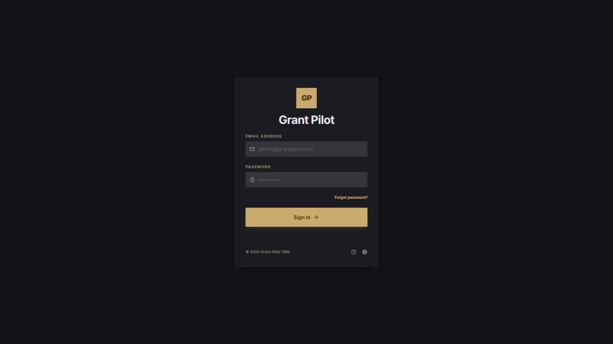
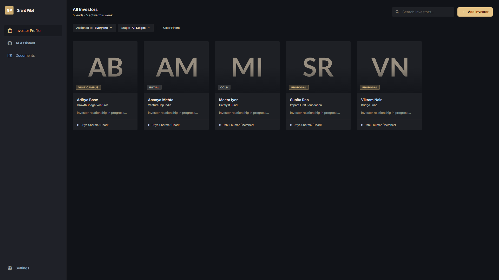
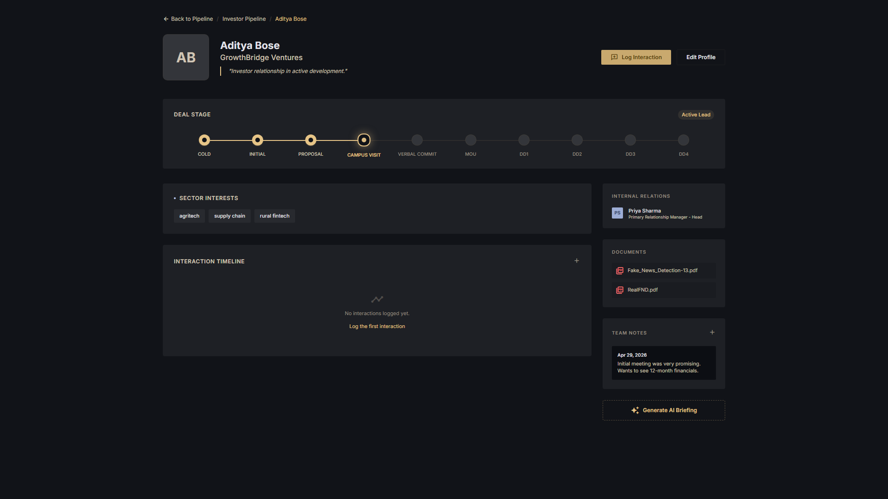
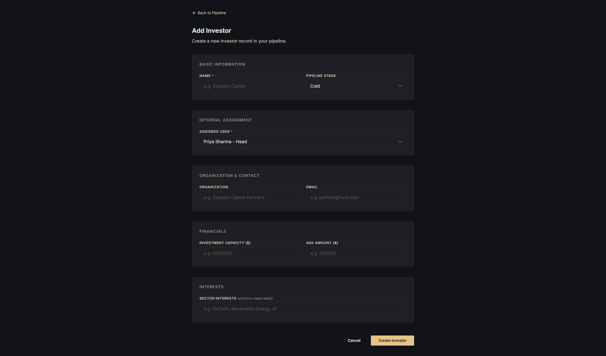
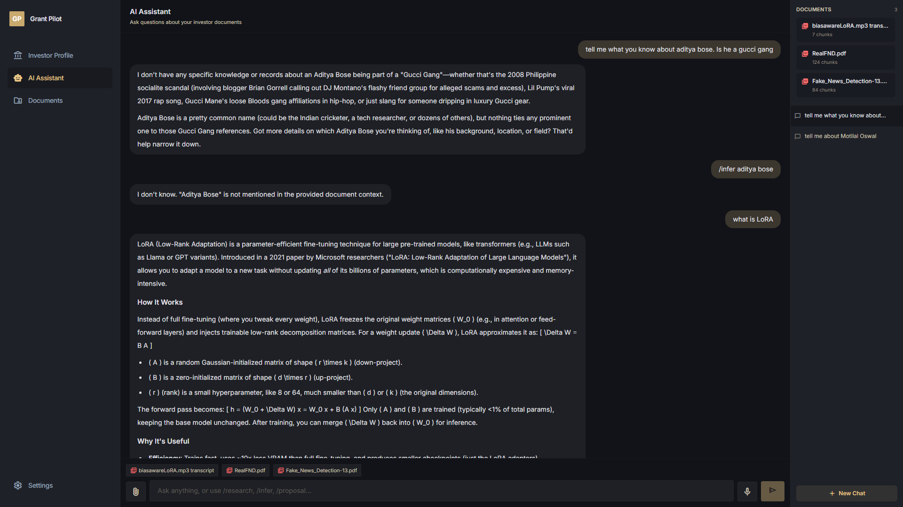
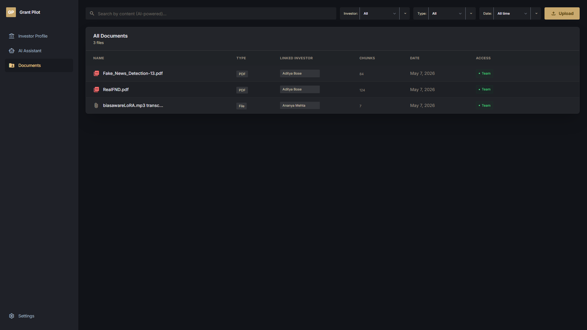
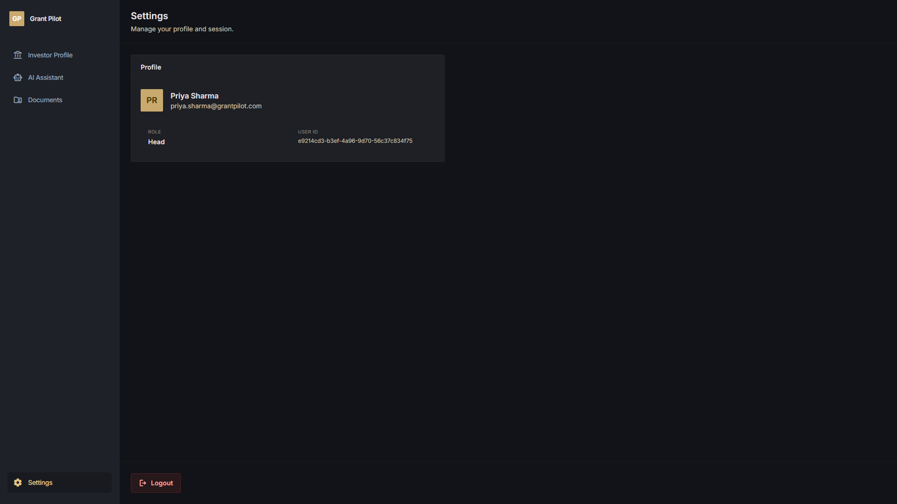

# Grant Pilot Features

This document describes the user-facing product features in Grant Pilot. Screenshots were captured in desktop mode at 1920px width and are stored in `docs/assets/features/`.

## 1. Authentication

Grant Pilot starts with a password-based login screen. Users sign in with email and password, and the frontend stores the returned bearer token in `localStorage`.

Supported capabilities:

- Email/password login.
- JWT-backed authenticated API access.
- Session persistence through browser storage.
- Invalid-login error handling.
- Logout from the Settings page, which clears the saved token and returns the user to `/login`.

Primary backend support:

- `POST /api/auth/login`
- `POST /api/auth/register`
- `GET /api/auth/me`

## 2. Investor Pipeline

The investor pipeline is the main CRM view. It shows all investor leads as cards with organization, stage, and assigned internal owner.

Supported capabilities:

- List all investors.
- Filter investors by assigned user.
- Filter investors by pipeline stage.
- Clear all filters.
- Navigate to an investor detail page.
- Navigate to the add-investor form.
- Show each investor's primary owner and role.
- Use canonical investor stages from the backend.

Current canonical stages:

1. Cold
2. Initial
3. Proposal
4. Visit Campus
5. Verbal Commitment
6. MOU
7. Draw Down 1
8. Draw Down 2
9. Draw Down 3
10. Draw Down 4

Primary backend support:

- `GET /api/investors`
- `GET /api/investors/stages`
- `GET /api/users`

## 3. Investor Profile

The investor profile is the detailed workspace for one investor. It combines CRM data, pipeline progress, notes, interactions, internal ownership, and linked documents.

Supported capabilities:

- View investor name, organization, email, stage, interests, capacity, and ask amount.
- View the deal-stage timeline.
- See stage state visually:
  - Completed: filled gold circle and gold line.
  - Current: gold ring with active glowing dot.
  - Upcoming: muted gray circle and muted line.
- Edit investor profile.
- Log interaction records.
- Add notes.
- View notes linked to the investor.
- View interactions linked to the investor.
- View internal relation / primary relationship manager.
- View documents linked to the investor.
- Open linked document files from the investor profile.

Primary backend support:

- `GET /api/investors/{investor_id}`
- `PUT /api/investors/{investor_id}`
- `GET /api/investors/{investor_id}/notes`
- `POST /api/notes`
- `GET /api/interactions?investor_id=...`
- `POST /api/interactions`
- `GET /api/documents`
- `GET /api/documents/{document_id}/download`

## 4. Add and Edit Investor

The add/edit investor form manages investor records and ensures each investor has an assigned internal owner.

Supported capabilities:

- Create a new investor.
- Edit an existing investor.
- Set canonical pipeline stage.
- Assign a primary owner from system users.
- Save organization, email, capacity, ask amount, and interests.
- Validate required name and assigned user fields.
- Validate supported stage values through the backend.

Primary backend support:

- `POST /api/investors`
- `PUT /api/investors/{investor_id}`
- `GET /api/investors/stages`
- `GET /api/users`

## 5. AI Assistant

The AI Assistant is a chat workspace with RAG, document attachment, streaming responses, speech-to-text, and slash-command modes.

Supported capabilities:

- Create and switch between chats.
- Delete old chats.
- Save user and assistant messages.
- Stream AI responses into the chat as they arrive.
- Render Markdown responses with proper formatting.
- Attach PDFs or supported audio files to a chat.
- Ingest attached files into the RAG database.
- Show documents attached to or referenced by the current chat in the right-side document panel.
- Show source chips under assistant messages.
- Use microphone input for speech-to-text dictation.
- Default to general AI + RAG behavior.
- Use slash commands for specialized AI modes:
  - `/research`
  - `/infer`
  - `/proposal`

AI behavior by mode:

- `general`: general LLM assistant. Uses RAG when available and can use web/current knowledge.
- `research`: investor research assistant. Web search is enabled and internal context may be used if retrieved.
- `proposal`: proposal drafting assistant. Uses files when available and can still work without documents.
- `infer`: strict document-grounded mode. Answers only from retrieved/attached document context.

Primary backend support:

- `GET /api/chats`
- `POST /api/chats`
- `GET /api/chats/{chat_id}`
- `DELETE /api/chats/{chat_id}`
- `POST /api/chats/{chat_id}/messages`
- `POST /api/chats/{chat_id}/documents`
- `POST /api/ai/query`
- `POST /api/ai/query/stream`
- `POST /api/audio/speech-to-text`

## 6. RAG and Document Intelligence

Grant Pilot has a pgvector-backed retrieval system behind documents and AI chat.

Supported capabilities:

- Store uploaded files in `documents`.
- Extract PDF text.
- Transcribe audio recordings.
- Split extracted text into chunks.
- Generate 384-dimensional embeddings with `sentence-transformers/all-MiniLM-L6-v2`.
- Store chunks and embeddings in `document_chunks`.
- Search chunks by pgvector cosine distance.
- Attach retrieved source documents to chats automatically.
- Use retrieved context in AI prompts.

Important tables:

- `documents`
- `document_chunks`
- `document_transcripts`
- `chat_documents`

Primary backend support:

- `POST /api/documents/upload`
- `POST /api/audio/transcribe`
- `POST /api/documents/search`
- `POST /api/ai/query`
- `POST /api/ai/query/stream`

## 7. Documents Workspace

The Documents tab manages the file corpus used by investor profiles and RAG.

Supported capabilities:

- View all uploaded documents.
- Upload PDFs.
- Upload audio recordings.
- Link uploaded documents to an investor.
- Show document type, linked investor, chunk count, date, and access indicator.
- Open/download files.
- Delete documents.
- Run AI-powered semantic document search.
- Show semantic search matches with relevance scores.
- Show the last generated audio transcript after an audio upload.
- Fetch stored audio/PDF file bytes from the backend.
- Fetch saved transcripts when available.

Primary backend support:

- `GET /api/documents`
- `POST /api/documents/upload`
- `POST /api/audio/transcribe`
- `POST /api/documents/search`
- `GET /api/documents/{document_id}/download`
- `GET /api/documents/{document_id}/transcript`
- `DELETE /api/documents/{document_id}`

## 8. Audio Processing and Speech-to-Text

Grant Pilot supports two audio workflows.

Audio as a document:

- Upload audio from the Documents page or attach audio in AI chat.
- Transcribe the audio with Whisper.
- Store the original audio bytes.
- Store the full transcript in `document_transcripts`.
- Chunk and embed the transcript into the RAG database.
- Link the transcript document to an investor or chat where applicable.

Voice dictation:

- Use the microphone button in AI Assistant.
- Record browser audio with `MediaRecorder`.
- Send audio to the backend.
- Return a transcript.
- Insert the transcript into the chat input without saving it as a RAG document.

Primary backend support:

- `POST /api/audio/transcribe`
- `POST /api/audio/speech-to-text`
- `POST /api/chats/{chat_id}/documents`

## 9. Settings and User Profile

The Settings page shows the current logged-in user and gives them a logout action.

Supported capabilities:

- Load current authenticated user.
- Show name, email, role, and user ID.
- Display `Head` or `Member` role labels.
- Logout and return to the login page.

Primary backend support:

- `GET /api/auth/me`

## 10. Evaluation Assets

The repository includes an evaluation scaffold for at least one AI endpoint.

Supported capabilities:

- Dataset with input and ground truth for the infer/RAG endpoint.
- LLM-as-judge evaluation path.
- Baseline single-prompt comparison.
- Agentic baseline comparison.
- JSON result output under `backend/evals/ai_infer/results/`.

Primary files:

- `backend/evals/ai_infer/dataset.jsonl`
- `backend/evals/ai_infer/run_eval.py`
- `backend/evals/ai_infer/README.md`
